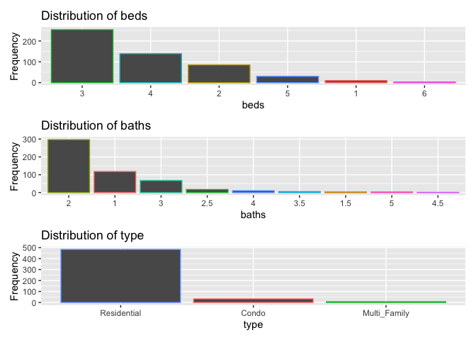
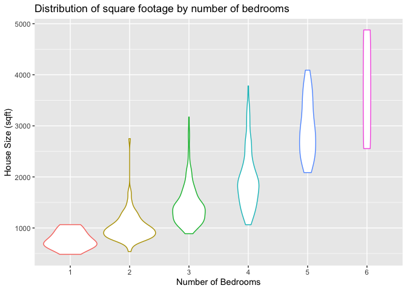

EDA of Sacramento House Prices
================
Lesley Miller
2/8/2020

``` r
# load packages
suppressPackageStartupMessages(library(tidyverse))
library(knitr)
library(patchwork)
library(formatR)
```

``` r
# load training data
df <- read_csv("data/X_train.csv")
```

    ## Parsed with column specification:
    ## cols(
    ##   city = col_character(),
    ##   zip = col_character(),
    ##   beds = col_double(),
    ##   baths = col_double(),
    ##   sqft = col_double(),
    ##   type = col_character(),
    ##   latitude = col_double(),
    ##   longitude = col_double()
    ## )

# Data Description

[Data Source](https://support.spatialkey.com/spatialkey-sample-csv-data)

> This dataset contains information on various attributes of homes sold
> in and around the Sacramento, California area. The data is from real
> estate transactions taking place over a 5 day period. The data is from
> the website for the `SpatialKey` software and can be found
> [here](https://support.spatialkey.com/spatialkey-sample-csv-data)

    ## [1] "The number of training examples is: 521"

    ## [1] "The number of predictors is: 8"

## Summary of Predictors

| Predictor |    Type     |                                                              Description |
| --------- | :---------: | -----------------------------------------------------------------------: |
| city      | categorical |                                     The city where the house is located. |
| zip       | categorical |                                 The zip code where the house is located. |
| beds      | categorical |                                     The number of bedrooms in the house. |
| baths     | categorical |                                    The number of bathrooms in the house. |
| type      | categorical | The type of dwelling as either `Residential`, `Condo` or `Multi-Family`. |
| sqft      | continuous  |                           The size of the house measured in square feet. |
| latitude  | continuous  |                           The latitude geospatial location of the house. |
| longitude | continuous  |                          The longitude geospatial location of the house. |

## Distribution of Categorical Predictors

> The most common number of bedrooms for a house is 3 with the second
> most common number being 4 bedrooms. Just under 100 homes of the 521
> in the training set contain 2 bedrooms and very few homes contain 1, 5
> or 6 bedrooms.

> The majority of the houses (~ 2/3) contain 2 bathrooms. One bathroom
> was second most common. Having 3 bathrooms was only present in about
> 15% of homes and having 1.5, 2.5, 3.5, 4, 4.5 or 5 bathrooms was very
> rare.

> Almost all of the homes were classifed as `Residential` with extremely
> few homes being classifed as `Condo` or `Multi-family`.

<!-- -->

## Distribution of House Size

| Smallest House Size | Largest House Size |
| ------------------: | -----------------: |
|                 484 |               4878 |

Range of House Square Footage

> The distribution of house size is pulled to the right with outliers of
> large house size. The homes range in size from 484 sq ft on the low
> end to 4878 sq ft on the high end. The peak of the density centers
> around ~ 1266 sq ft.

<!-- -->

> As expected, with a rising number of bedrooms, the bulk of the
> distribution for house size also rises but there is variability within
> different levels of bedrooms. After one-bedrooms there is a wide range
> of sizes for homes with 2 bedrooms and beyond. However, as the number
> of bedrooms rises, the density becomes thinner and thinner as fewer
> and fewer homes are have 4 or more bedrooms.

<!-- -->

> Like with number of bedrooms, the house size increases with the number
> of bathrooms present but there still is considerable variability.
> Houses with 1.5 bathrooms have a very small range of house sizes. The
> density of the distributions becomes very thin as the number of
> bathrooms increases. Something potentially to consider is since there
> is considerable variability and overlap in size for houses with
> different bathrooms the question becomes if number of bathrooms will
> be a good predictor. On the extreme ends of bath number, the
> distributions of size are different enough and do not overlap.

<!-- -->

# Conclusions

### Potential Problems with the Data

> 

### Is the data appropriate to the question

### Sketch out the answer

# References
