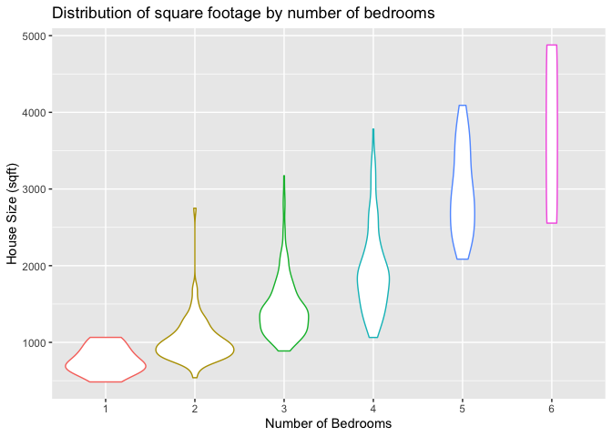
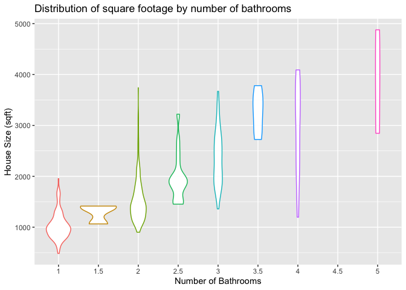

EDA of Sacramento House Prices
================
Lesley Miller
2/8/2020

  - [Data Description](#data-description)
      - [Missing Data](#missing-data)
      - [Summary of Predictors](#summary-of-predictors)
      - [Distribution of Categorical
        Predictors](#distribution-of-categorical-predictors)
      - [Distribution of House Size](#distribution-of-house-size)
  - [Correlation Matrix](#correlation-matrix)
  - [Conclusions](#conclusions)
      - [Potential Problems with the
        data](#potential-problems-with-the-data)
      - [Is the data appropriate to the
        question](#is-the-data-appropriate-to-the-question)
      - [Research question formulation](#research-question-formulation)
  - [References](#references)

# Data Description

[Data Source](https://support.spatialkey.com/spatialkey-sample-csv-data)

> This dataset contains information on various attributes of homes sold
> in and around the Sacramento, California. The data is from real estate
> transactions taking place over a 5 day period. The data is from the
> website for the `SpatialKey` software and can be loaded using the R
> caret package (Kuhn 2020) or downloaded as a `csv` from
> [here](https://support.spatialkey.com/spatialkey-sample-csv-data).

    ## [1] "The number of training examples is: 521"

    ## [1] "The number of predictors is: 8"

## Missing Data

> The graphic below shows that all 521 rows of the dataset are complete.

    ##  /\     /\
    ## {  `---'  }
    ## {  O   O  }
    ## ==>  V <==  No need for mice. This data set is completely observed.
    ##  \  \|/  /
    ##   `-----'

    ##     city zip beds baths sqft type latitude longitude  
    ## 521    1   1    1     1    1    1        1         1 0
    ##        0   0    0     0    0    0        0         0 0

## Summary of Predictors

| Predictor |    Type     |                                                              Description |
| --------- | :---------: | -----------------------------------------------------------------------: |
| city      | categorical |                                     The city where the house is located. |
| zip       | categorical |                                 The zip code where the house is located. |
| beds      | categorical |                                     The number of bedrooms in the house. |
| baths     | categorical |                                    The number of bathrooms in the house. |
| type      | categorical | The type of dwelling as either `Residential`, `Condo` or `Multi-Family`. |
| sqft      | continuous  |                           The size of the house measured in square feet. |
| latitude  | continuous  |                           The latitude geospatial location of the house. |
| longitude | continuous  |                          The longitude geospatial location of the house. |

## Distribution of Categorical Predictors

> The most common number of bedrooms for a house is 3 with the second
> most common number being 4 bedrooms. Just under 100 homes of the 521
> in the training set contain 2 bedrooms and very few homes contain 1, 5
> or 6 bedrooms.

> The majority of the houses (\~ 2/3) contain 2 bathrooms. One bathroom
> was second most common. Having 3 bathrooms was only present in about
> 15% of homes and having 1.5, 2.5, 3.5, 4, 4.5 or 5 bathrooms was very
> rare.

> Almost all of the homes were classifed as `Residential` with extremely
> few homes being classifed as `Condo` or `Multi-family`.

<!-- -->

## Distribution of House Size

| Smallest House Size | Largest House Size |
| ------------------: | -----------------: |
|                 484 |               4878 |

Range of House Square Footage

> The distribution of house size is pulled to the right with outliers of
> large house size. The homes range in size from 484 sq ft on the low
> end to 4878 sq ft on the high end. The peak of the density centers
> around \~ 1266 sq ft.

<!-- -->

> As expected, with a rising number of bedrooms, the bulk of the
> distribution for house size also rises but there is variability within
> different levels of bedrooms. After one-bedrooms, there is a wide
> range of sizes for homes with 2 bedrooms and beyond. However, as the
> number of bedrooms rises, the density becomes thinner and thinner as
> fewer and fewer homes are have 4 or more bedrooms.

<!-- -->

> Like with number of bedrooms, the house size increases with the number
> of bathrooms present but there still is considerable variability.
> Houses with 1.5 bathrooms have a very small range of house sizes. The
> density of the distributions becomes very thin as the number of
> bathrooms increases. Something potentially to consider is since there
> is considerable variability and overlap in size for houses with
> different bathrooms the question becomes if number of bathrooms will
> be a good predictor. On the extreme ends of bath number, the
> distributions of size are different enough and do not overlap.

<!-- -->

# Correlation Matrix

> 

<!-- -->

# Conclusions

### Potential Problems with the data

> After conducting this visual exploration, there doesn’t seem to be any
> problems to report. The dataset is complete and the variables have
> reasonable distributions (i.e. nothing is terribly skewed)

### Is the data appropriate to the question

> The research question for this project will be about discovering the
> relation between house price and the predictors. How will changing the
> values of the predictors influence the house price? Are there
> predictors that affect the house price more than others? This dataset
> provides some basic attributes about a house that should prove to be
> useful in inferring house price (i.e. housing type, bed and bath
> number etc.)

### Research question formulation

> The primary inferential research question for this probject will be\`

  - How are the predictors related to the response? (linear? polynomial?
    etc)

> Related questions will include:

  - Which of the predictors are most strongly associated with the
    response of house price?

  - If the bed and bathroom number or house size increase, how does this
    affect the house price?

#### Analysis Packages

The tools for this exploratory analysis include the R language (R Core
Team 2019), and the following R packages: tidyverse (Wickham 2017), mice
(van Buuren and Groothuis-Oudshoorn 2011), knitr (Xie 2014), here
(Müller 2017), ggcorrplot (Kassambara 2019) and patchwork (Pedersen
2019).

This analysis uses the `Sacramento` dataset obtained through the R caret
package (Kuhn 2020).

# References

Kassambara, Alboukadel. 2019. *Ggcorrplot: Visualization of a
Correlation Matrix Using ’Ggplot2’*.
<https://CRAN.R-project.org/package=ggcorrplot>.

Kuhn, Max. 2020. *Caret: Classification and Regression Training*.
<https://CRAN.R-project.org/package=caret>.

Müller, Kirill. 2017. *Here: A Simpler Way to Find Your Files*.
<https://CRAN.R-project.org/package=here>.

Pedersen, Thomas Lin. 2019. *Patchwork: The Composer of Plots*.
<https://CRAN.R-project.org/package=patchwork>.

R Core Team. 2019. *R: A Language and Environment for Statistical
Computing*. Vienna, Austria: R Foundation for Statistical Computing.
<https://www.R-project.org>.

van Buuren, Stef, and Karin Groothuis-Oudshoorn. 2011. “mice:
Multivariate Imputation by Chained Equations in R.” *Journal of
Statistical Software* 45 (3): 1–67.
<https://www.jstatsoft.org/v45/i03/>.

Wickham, Hadley. 2017. *Tidyverse: Easily Install and Load the
’Tidyverse’*. <https://CRAN.R-project.org/package=tidyverse>.

Xie, Yihui. 2014. “Knitr: A Comprehensive Tool for Reproducible Research
in R.” In *Implementing Reproducible Computational Research*, edited by
Victoria Stodden, Friedrich Leisch, and Roger D. Peng. Chapman;
Hall/CRC. <http://www.crcpress.com/product/isbn/9781466561595>.

