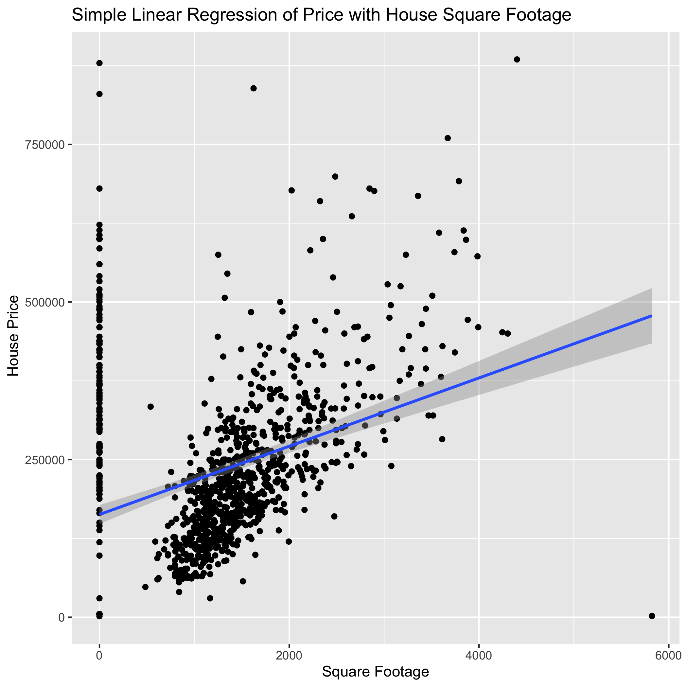

```{r setup, include=FALSE}
knitr::opts_chunk$set(echo = FALSE)
knitr::opts_knit$set(root.dir = here::here())
suppressPackageStartupMessages(library(tidyverse))
library(knitr)
```

```{r load in data, include=FALSE}
# load data 
test_stats_table <- read_csv("results/test_stats_table.csv")
house_size_range <- read_csv("results/house_size_range.csv")

```

## Project Objective
The purpose of this project was to understand how house size is related to house price in a small sample of Sacramento homes. A simple linear regression with square footage and price was performed to better understand this relationship. 

## Data Exploration 
[Data Source](https://support.spatialkey.com/spatialkey-sample-csv-data)

> This dataset contains information on various attributes of homes sold in and around Sacramento, California. The data is from real estate transactions taking place over a 5 day period and was obtained from the website for `SpatialKey` software; data can loaded using the R caret package [@caret] or downloaded as a `csv` from [here](https://support.spatialkey.com/spatialkey-sample-csv-data). 

### Data Summary 
|Predictor | Type | Description |
|-----------|:--------:|---------:|
|city | categorical| The city where the house is located.|
|zip | categorical | The zip code where the house is located.|
|beds | categorical | The number of bedrooms in the house.|
|baths | categorical | The number of bathrooms in the house.|
|type | categorical | The type of dwelling as either `Residential`, `Condo` or `Multi-Family`. |
|sqft | continuous | The size of the house measured in square feet.|
|latitude| continuous | The latitude geospatial location of the house.|
|longitude| continuous | The longitude geospatial location of the house.|

### Distribution of House Size
The analysis will build a model using house size only so Table 1 and Figure 1 describe the distribution of the `sqft` variable. The size distribution of the homes is quite large as the smallest home on record is 484 sq. ft. and the largest is 4,878 sq. ft. (see Table 1). The house size is skewed to the right with a few very large homes that are greater than 3,000 square feet (Figure 1). 
```{r}
kable(house_size_range, caption = "Table 1")
```


```{r sqft density plot, fig.cap="Figure 1", out.width='50%', out.height='50%', fig.align='center'}

```

Judging by the visual pattern in Figure 2 between square footage and house price, it was expected that a linear model would do well to capture the relationship between them. 

```{r sqft vs price, fig.cap="Figure 2", out.width="50%", out.height="50%", fig.align='center'}

```

## Analysis Methods 
A price of a home was modelled using a simple linear regression and square footage as the sole explanatory variable. This analysis was carried out using the R language [@R] the following R packages: tidyverse [@tidyverse], broom [@broom], knitr [@knitr], docopt [@docopt] and here [@here].

## Results 
A simple linear regression with price and square footage revealed a ~ $139 increase in the price for every additional square foot (Table 2) and had a p-value much less than 5% significance. 
```{r result_table}
kable(test_stats_table, caption = "Table 2: Estimates and test stastics for the model slope and intercept.")
```


```{r result_plot, fig.cap="Figure 3: Simple linear model with 95% confidence bands for the slope.", out.width='50%', out.height='50%', fig.align='center'}


```

## Conclusions
It was found that for homes in and around Sacramento every additional square footage of space produced an increase in price of ~ $139. This relationship was found to be statistically significant at the 5% significance level. Though this relationship was significant, the house size only explains ~ 60% of the variation in price. There are undoubtedly other factors that contribute to the house price though square footage is clearly a strong factor. 

### Next Steps 
The next step would be to include other variables in the dataset to come up with a better model that explains more than 60% of the variation in the house price. The city and geo-coordinates are both good candidates and potentially the number of bedrooms and bathrooms; an analysis including the bedrooms, bathrooms and square footage will have to assess if multi-collinearity will be a problem since house size and number of beds and baths is strongly correlated. 

## References 
